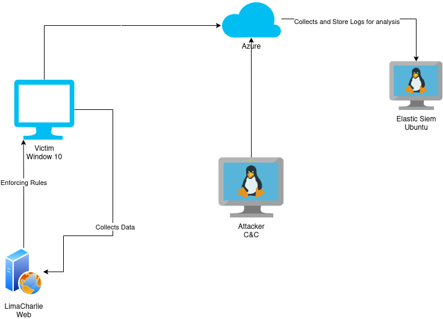
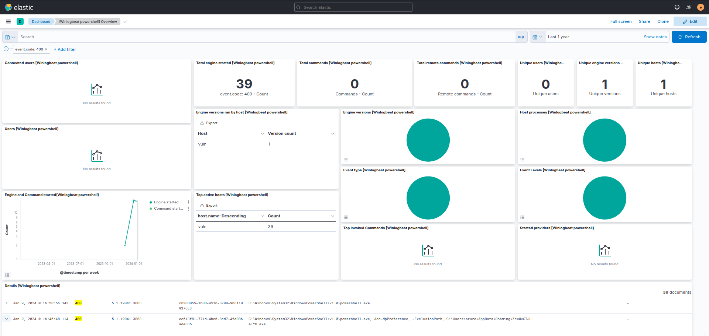
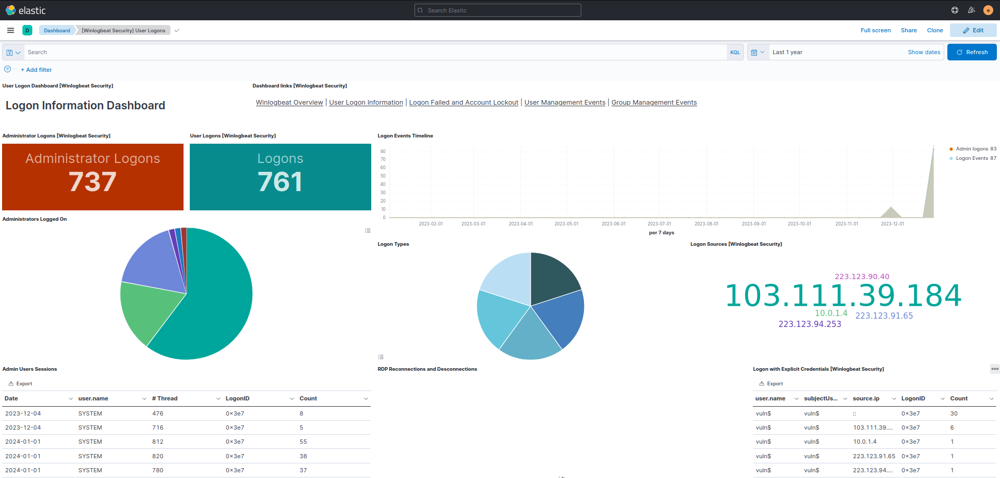
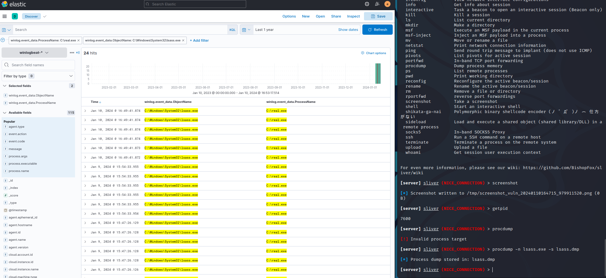
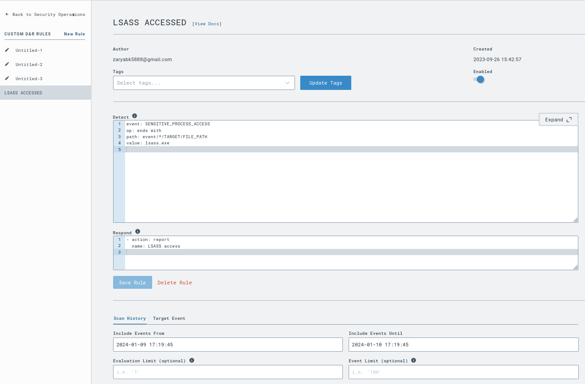
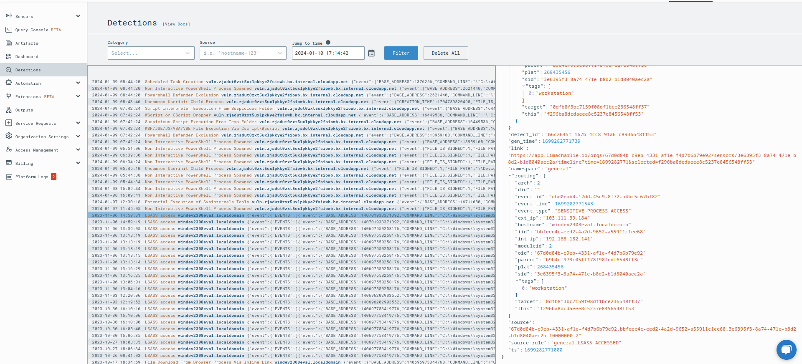

<h1>SOC-LAB</h1>

<strong>Cybersecurity Project</strong>

<h2>Challenges</h2>

Setting up Elastic (SIEM) 

Since the project is on cloud i was finally able to understand how to effectively use public and private ip 

<h2>Project Overview</h2>

This project demonstrates a cybersecurity mechanism to protect a Windows 10 system, collect data, and analyze logs for threat detection.

<h3>Components</h3>

<ul>
    <li><strong>Victim (Windows 10):</strong> Target system connected to enforcing rules and data collection.</li>
    <li><strong>Enforcing Rules:</strong> Mechanisms/protocols safeguarding the system.</li>
    <li><strong>LimaCharlie Web:</strong> Tool collecting data from Windows 10 for analysis.</li>
    <li><strong>Azure:</strong> Cloud service storing and analyzing logs.</li>
    <li><strong>Attacker C&C:</strong> Monitored system for suspicious activities.</li>
    <li><strong>Elastic Siem Ubuntu:</strong> Security tool analyzing logs and detecting threats.</li>
</ul>

<h3>Architecture Diagram</h3>

<h2>How to Run the Project</h2>

<h3>Requirements</h3>

<ul>
    <li>Windows 10</li>
    <li>LimaCharlie Web</li>
    <li>Azure</li>
    <li>Elastic Siem Ubuntu</li>
</ul>

<h3>Instructions</h3>

Refer to detailed instructions: <a href="https://blog.ecapuano.com/p/so-you-want-to-be-a-soc-analyst-intro">https://blog.ecapuano.com/p/so-you-want-to-be-a-soc-analyst-intro</a>.

<h2>Additional Points</h2>

<ul>
    <li>Prebuilt Elastic Dashboards (e.g., Powershell commands) are helpful.</li>
    <li>AgentTesla detection using the dashboard demonstrates effectiveness.</li>
    <li>Own malware (sliver-server) created for controlled damage and log observation.</li>
    <li>Data dumping from lsass.exe, a crucial Windows security process.</li>
    <li>LimaCharlie rule creation for lsass.exe detection and successful testing.</li>
</ul>

<h2>Screenshots</h2>

